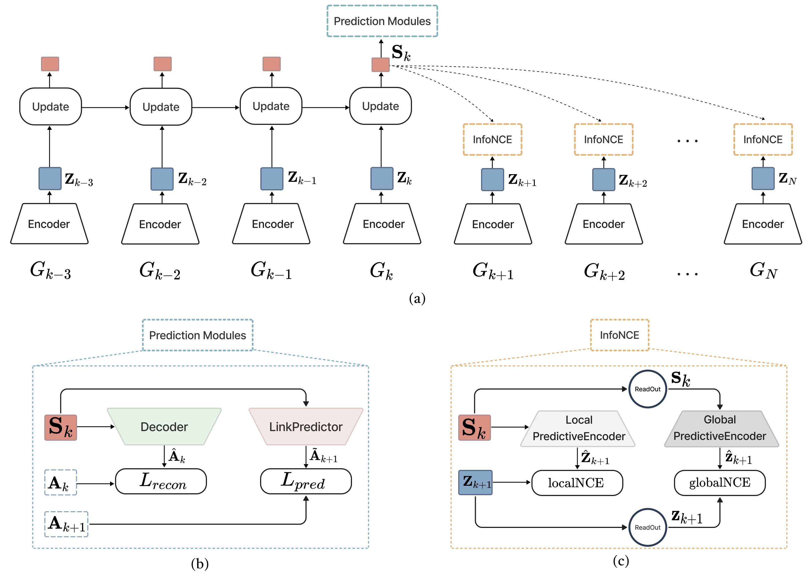

# teneNCE: Temporal Network Noise Contrastive Estimation for Dynamic Link Prediction

<p align="center">
  
</p>

_**Figure 1**: Illustration of the teneNCE model architecture._

## Introduction
In a variety of scientific and engineering contexts, processes can be modeled as dynamical systems over 
evolving networks where the structure and features change over time.
Examples include disease transmission through contact networks, information propagation in communication networks, 
and complex systems like brain networks, biological networks, ecological networks, and financial transaction networks.
Learning expressive representations for such networks that encode both structural connectivity and their temporal
evolution is essential for downstream data analytics and machine learning applications.
Traditional methods often struggle to integrate both the structural and temporal information inherent in these networks.

In this work, we present _**teneNCE (Temporal Network Noise Contrastive Estimation)**_, a novel approach for 
learning expressive representations of temporal networks. 
Our method addresses the challenge of encoding both the structural and temporal aspects of dynamic graphs 
into meaningful vector representations. 
This is achieved through a local and global self-supervised training of a recurrent message-passing neural network architecture 
designed to model information flow along time-respecting paths within the network.

Key features of our method include:
- **Recurrent Message-Passing Architecture:** Facilitates the flow of information over time-respecting paths in 
the temporal network, capturing the dynamic nature of interactions.
- **Contrastive Training Objective:** Combines link prediction, graph reconstruction, and 
contrastive predictive coding losses. This objective integrates self-supervised infoNCE losses at 
both local and global scales, balancing the extraction of short-term features with long-term dynamics.
- **Performance:** We evaluate teneNCE on datasets including _Enron_, _COLAB_, and _Facebook_, demonstrating 
superior performance in dynamic link prediction tasks compared to existing models.

Our approach effectively combines structural and temporal information, improving the accuracy of dynamic link predictions and offering a robust method for future research in temporal network analysis.

For further details on implementation and usage, please refer to the sections below.
This is a PyTorch implementation of the teneNCE model as described in the paper.

## Installation

To set up the environment for running the **teneNCE** implementations, follow these steps:

### System Requirements
- Python 3.10 or higher
- Pip package manager

### Dependencies
The **teneNCE** implementations are based on the following libraries:

- **PyTorch**: Version 2.3.0. For detailed installation instructions, 
refer to the [PyTorch installation guide](https://pytorch.org/get-started/previous-versions/) 
or [PyTorch local installation](https://pytorch.org/get-started/locally/) page.

- **PyTorch Geometric**: This library is used for implementing GNNs and graph-based machine learning tasks. 
For installation, follow the instructions on 
the [PyTorch Geometric installation](https://pytorch-geometric.readthedocs.io/en/latest/install/installation.html) page.

- All other dependencies are listed in the `requirements.txt` file.

### Installation Steps
1. Clone the Repository:
```bash
git clone https://github.com/amrhssn/teneNCE.git
cd teneNCE
```
2. Create and activate a virtual environment (optional but recommended):
```bash
python -m venv venv
source venv/bin/activate 
```
3. Install Dependencies:
```bash
pip install torch==2.3.0
pip install torch_geometric
pip install pyg_lib torch_scatter torch_sparse torch_cluster torch_spline_conv -f https://data.pyg.org/whl/torch-2.3.0+cpu.html
pip install -r requirements.txt
```

## Usage

To run the **teneNCE** implementation, you will primarily interact with the `main.py` file. 
Below are instructions for using the code and understanding the hyperparameters.

### Running the Code

The `main.py` script requires a dataset name argument to specify which dataset to use. 
The available options are `enron`, `facebook`, and `colab`. 
By default, the code will run on the _Enron_ dataset if no argument is provided.

To run the code with a specific dataset, use the following command:

```bash
python main.py --dataset_name <dataset_name>
```

Replace `<dataset_name>` with one of the available options (`enron`, `facebook`, `colab`).
For example, to run the code on the _Facebook_ dataset, use:
```bash
python main.py --dataset_name facebook
```

### Hyperparameters
The hyperparameters for the model are configured in the `config.ini` file. 
Here’s a description of each hyperparameter:

- **EPOCHS**: Number of training epochs. Default is `1000`. 

- **TRAIN_TEST_RATIO**: The ratio of training to testing data split. Default is `0.3`, 
meaning that the last 30% of the snapshot sequence is used for testing while the first 70% is used for training.

- **HIDDEN_DIM**: Dimensionality of the hidden layers in the model. Default is `256`.

- **OUTPUT_DIM**: Dimensionality of the node representations. Default is `256`.

- **ALPHA**: Weight for the graph reconstruction loss. Default is `1.0`.

- **BETA**: Weight for the contrastive predictive coding loss. Default is `1.0`.

- **LEARNING_RATE**: Learning rate for the optimizer. Default is `0.001`. 

- **WEIGHT_DECAY**: Weight decay for the regularization. Default is `0.0005`.

- **SCHEDULER_PATIENCE**: Number of epochs with no improvement before reducing the learning rate. Default is `200`. 

- **SCHEDULER_FACTOR**: Factor by which the learning rate is reduced. Default is `0.8`. 

- **SCHEDULER_MIN_LR**: Minimum learning rate after reduction. Default is `0.0001`. 
 
## Data
Although temporal networks are most generally represented in continuous time, the **teneNCE** method focuses
on discrete-time dynamic graphs, also known as snapshot sequences. It represents temporal networks as a series of static graphs, each capturing interactions within fixed time intervals. This approach allows for handling large volumes of interactions efficiently while encoding both temporal and topological information for downstream machine learning tasks.

The discretization process is illustrated in the figure below.

<p align="center">
  
</p>

_**Figure 2**: Illustration of a temporal network and its corresponding snapshot sequence._


Specifically, the experiments in this project are conducted using three datasets:

| **Attribute**   | **Enron** | **Colab** | **Facebook** |
|-----------------|-----------|-----------|--------------|
| **# Nodes**     | 184       | 315       | 663          |
| **# Edges**     | 4,784     | 5,104     | 23,394       |
| **# Timesteps** | 11        | 10        | 9            |

### Datasets

1. **Enron**: 
   - **Description**: This dataset captures the email communication network of the Enron Corporation. Nodes represent employees, and edges correspond to email exchanges between colleagues. It provides a historical perspective on interactions among employees.
   - **Location**: The raw data files for the Enron dataset are stored at `datasets/raw_data/enron`.

2. **Colab**:
   - **Description**: This dataset consists of collaboration data among 315 authors. Each author is represented as a node, and edges correspond to co-authorship relationships. It is designed for analyzing collaboration networks and academic interactions.
   - **Location**: The raw data files for the Colab dataset are stored at `datasets/raw_data/colab`.

3. **Facebook**:
   - **Description**: This dataset represents social connections among users on the Facebook platform. It contains a dynamic graph of friendships and interactions, which is useful for studying social network dynamics, information diffusion, and community structures within an online social network.
   - **Location**: The raw data files for the Facebook dataset are stored at `datasets/raw_data/facebook`.

### Preprocessing

The raw data files are transformed into a list of PyTorch Geometric `Data` objects, `List[Data]`, 
using the `preprocess_raw_data` function found in the `utils/data.py` file.

Additionally, the `get_data` function in the same file loads the processed data and returns the 
training and testing indices for the snapshot sequence `List[Data]`.

For more details, refer to the `utils/data.py` file where these functions are implemented.

## Citation

Please cite our paper if you use this code in your own work:

```bibtex
@article{teneNCE,
  title={Contrastive Representation Learning for Dynamic Link Prediction in Temporal Networks},
  author={Amirhossein Nouranizadeh, Fatemeh Tabatabaei and Mohammad Rahmati},
  year={2024},
  journal={Journal Name},
  note={\textbf{*}equal contribution}
}
```

## Contact

For any questions or inquiries, please feel free to contact us:

- **Fatemeh Tabatabaei:** [tabatabaeifatemeh@gmail.com](mailto:tabatabaeifateme@gmail.com)
- **Amirhossein Nouranizadeh:** [amirhossein.nouranizadeh@gmail.com](mailto:amirhossein.nouranizadeh@gmail.com)


